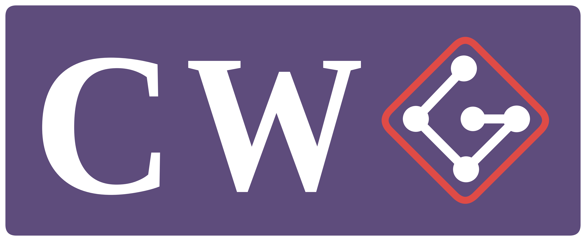

# Coding With Git

> **Work in progress.** This project is in early draft stage. Syntax and semantics are subject to change.

CWG is a programming language where the source code *is* the git history. Commit messages are statements, branches are control flow blocks, and merges close those blocks. The interpreter walks the commit DAG and executes it as a program.

The goal is to use git as a genuine programming medium. Readable syntax, real execution, built entirely on top of version control primitives.

---

## Concept

| Git construct | Language construct |
|---|---|
| `git commit -m "..."` | Statement / instruction |
| Branch | Conditional block or loop |
| Merge | Close a block, return to parent scope |
| Tag | Function definition |
| `cherry-pick` | Function call |
| `revert` | Exception handler / undo |
| `git stash` | Push to memory stack |
| `git stash pop` | Pop from memory stack |

---

## Syntax

CWG executes Python syntax inside commit messages. Commit messages must be valid Python statements for the interpreter to recognize and run them.

### Variables, int, string, bool, int operator 

```bash
git commit -m "x = 5"
git commit -m "name = 'world'"
git commit -m "active = True"
git commit -m "x = x + 1"
```

### If / Else

Branches named `if/<name>` and `else/<name>` define conditional blocks. The condition is the first commit of the `if/` branch.

```bash
git branch if/large
  git commit -m "if x > 10:"
  git commit -m "    print('x is large')"
git checkout main
git branch else/small
  git commit -m "    print('x is small')"
git checkout main
git merge if/large
git merge else/small
```

### While Loops

Branches named `while/<name>` define while loops. The first commit in the branch is the `while` condition.

```bash
git commit -m "i = 10"
git branch while/countdown
  git commit -m "while i > 0:"
  git commit -m "    print(i)"
  git commit -m "    i = i - 1"
git checkout main
git merge while/countdown
git commit -m "print('blastoff')"
```

### For Loops

Branches named `for/<name>` define for loops. The first commit in the branch is the `for` header — both `for x in iterable:` and tuple-unpacking forms like `for x, y in pairs:` are supported.

```bash
git commit -m "total = 0"
git branch for/sum
  git commit -m "for i in [1, 2, 3, 4, 5]:"
  git commit -m "    total = total + i"
git checkout main
git merge for/sum -m "return total"
```

### Functions

Functions are defined as tagged commit ranges and called via `cherry-pick`.

```bash
git tag -a "fn/greet"
git commit -m "    print('hello ' + name)"
git commit -m "    return"
git tag -a "end-fn/greet"

# call the function
git cherry-pick fn/greet
```

---

## Branch Naming Conventions

| Prefix | Purpose |
|---|---|
| `main` / `master` | Global scope |
| `if/<name>` | Conditional true block |
| `else/<name>` | Conditional false block |
| `while/<name>` | While loop |
| `for/<name>` | For loop |
| `fn/<name>` | Function definition |
| `check/<name>` | Inline conditional (if/elif/else one-liners) |

---

## Scoping

- `main` holds global scope
- `if/`, `else/`, `while/`, and `for/` branches each receive a copy of the parent scope at the moment they start
- `else/` always starts from the parent scope — never from the `if/` branch's scope
- `check/` branches run directly in the parent scope with no isolation
- Variables modified inside a branch are discarded on merge unless explicitly returned
- Returned values are promoted back into the parent scope

## Execution Model

CWG uses a **first-parent walk** to traverse the commit DAG. When `cwg run` is called, the interpreter walks `main` from the first commit to HEAD, oldest to newest, applying these rules at every level:

1. **Regular commit** — execute the message as a Python statement, save a state snapshot
2. **Merge commit** — pause, walk the branch's commits as a self-contained block (oldest to newest), execute the block, apply any returned values to parent scope, continue on `main`
3. **Revert commit** — restore the state snapshot from before the reverted commit, continue

Because branches can contain branches, rule 2 is recursive. The same three rules apply at every level of nesting.

Nothing executes as commits are written. The full history is read first, then executed in one pass.

---

## Merging

When a branch merges back into `main`, any variables modified inside the branch are discarded unless explicitly returned via the merge commit message.

Multiple variables can be returned comma-separated:

```bash
git merge while/countdown -m "return i"
git merge while/multi -m "return i, j, k"
```

Only the variables named in the return are promoted back into the parent scope. Everything else is dropped.

If no return is specified, the branch is treated as side-effects only — prints and other output still happen, but no state is promoted back. This is valid and intentional, not an error.

---

## Revert and Exception Handling

`git revert` serves two purposes in CWG: undoing a coding mistake, and handling exceptions.

### Pure undo

A revert with no added message restores the scope to what it was just before the target commit ran. This is how you "edit" a mistake without rewriting history.

```bash
git commit -m "x = 1"
git commit -m "x = 99"   # oops
git revert HEAD          # x is now back to 1
```

The target can be any commit by SHA, not just the previous one:

```bash
git revert abc1234       # rolls back state to before abc1234 ran
```

### Exception handler

If you add code to the revert commit message (via `git revert <sha> --edit`), that code runs only if the target commit raised an error. If the target succeeded, the revert is a no-op.

```bash
git commit -m "result = 1 / x"   # might fail if x == 0
git revert HEAD --edit
# message becomes:
#   result = -1
#
#   This reverts commit abc1234.
```

When `x == 0` the original commit raises `ZeroDivisionError`, the handler runs, and `result = -1`. When `x != 0` the original succeeds and the handler is skipped.

### Detection

CWG detects reverts by the auto-generated `This reverts commit <sha>.` line that `git revert` produces. Manually writing a commit with a message starting with "revert" does not trigger revert behaviour — you must use the `git revert` command.

---

## Sample Programs

### Hello World

```bash
git init hello-world
git commit -m "message = 'hello world'"
git commit -m "print(message)"
# output: hello world
```

### Countdown

```bash
git init countdown
git commit -m "i = 10"
git branch while/countdown
  git commit -m "while i > 0:"
  git commit -m "    print(i)"
  git commit -m "    i = i - 1"
git checkout main
git merge while/countdown
git commit -m "print('blastoff')"
# output: 10 9 8 7 6 5 4 3 2 1 blastoff
```

### FizzBuzz

```bash
git init fizzbuzz
git commit -m "i = 1"
git branch while/fizzbuzz
  git commit -m "while i <= 20:"
  git branch check/fizzbuzz
    git commit -m "    if i % 15 == 0: print('FizzBuzz')"
  git checkout while/fizzbuzz
  git merge check/fizzbuzz
  git branch check/fizz
    git commit -m "    elif i % 3 == 0: print('Fizz')"
  git checkout while/fizzbuzz
  git merge check/fizz
  git branch check/buzz
    git commit -m "    elif i % 5 == 0: print('Buzz')"
  git checkout while/fizzbuzz
  git merge check/buzz
  git branch check/default
    git commit -m "    else: print(i)"
  git checkout while/fizzbuzz
  git merge check/default
  git commit -m "    i = i + 1"
git checkout main
git merge while/fizzbuzz
```

---

## Data Types

| Type | Example |
|---|---|
| int | `x = 5` |
| float | `pi = 3.14` |
| string | `name = 'alice'` |
| bool | `flag = True` |
| list | `nums = [1, 2, 3]` |

---

## Installation

### Prerequisites

- Python 3.10 or newer
- Git

### Setup

Clone the repo, create a virtual environment, and install CWG in editable mode:

```bash
git clone <repo-url>
cd CWG-Coding_with_Git
python3 -m venv .venv
source .venv/bin/activate          # macOS / Linux
# .venv\Scripts\activate           # Windows
pip install -e .
```

The `pip install -e .` step installs CWG itself, makes the `cwg` command available on your `PATH`, and pulls in the runtime dependency (GitPython).

To also run the test suite:

```bash
pip install pytest pytest-cov
pytest
```

### Hello world

```bash
mkdir hello && cd hello
git init
git commit --allow-empty -m "message = 'hello world'"
git commit --allow-empty -m "print(message)"
cwg run .
# output: hello world
```

---

## Status

This project is a work in progress. See [CONTRIBUTING.md](https://github.com/JakeRecharte/CWG-Coding_with_Git/blob/main/docs/CONTRIBUTING.md) for how to get involved.
